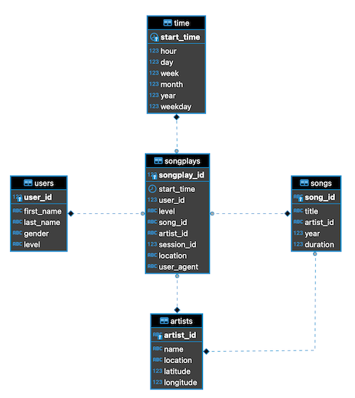

# Udacity Data Engineer Course / Project 1: Data Modeling with Postgres

## 1 Description


## 2 Project Setup
### 2.1 Prerequisites
The following tools/packages/framework have to be installed on your system
- docker and docker-compose
- python3 with psycopg2 and pandas
- jupyter (to open the jupyter notebooks) and inside psycopg2 and pandas

### 2.2 Run the project
- First run ```docker-compose up``` to fire up the postgresDB

To run the python scripts:
1. run ```python3 create_tables.py``` to create the sharkifydb and all the tables needed
2. run ```python3 etl.py``` to fill the tables with data from the json files (song_data, log_data)

Jupyter Notebooks:
1. ETL: run all commands inside the etl.ipynb. This will create the sharkifydb and all the tables needed and fill the tables with data from the json files (song_data, log_data)
2. SQL Queries: run all commands inside the test.ipynb. This will give you an short overview about the data from the database
3. Analytics: run all commands inside the analytics.ipynb. This will give you some anylitics drawn from the data in the database

## 3 ER-Diagram


## 4 Jupyter Notebooks
| Name                      	| Description                                                    	|
|---------------------------	|----------------------------------------------------------------	|
| test.ipynb                   	| displays the first few rows of each table to let you check your database. |
| etl.ipynb                     | reads and processes a single file from song_data and log_data and loads the data into your tables. This notebook contains detailed instructions on the ETL process for each of the tables.  	    |
| analytics.ipynb           	| contains some analytics example queries for the data              	|
